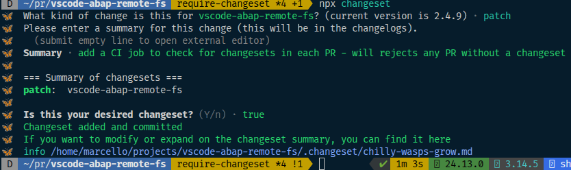

# Contributing

So you want to contribute to ABAP FS? You're either very brave or very lost. Either way, welcome.

## Using AI to Contribute

Let's be real — your AI is probably going to write most of the code. That's fine. But:

- **Feed it this file.** Seriously. Paste this entire CONTRIBUTING.md into your AI's context before you start. It'll save you a rejected PR
- **You're still responsible for the output.** Review what it generates. Check the diff. Don't blindly commit
- **AI loves creating files.** Watch for random `.md` plans, scratch notes, and "helper" files it drops in your working directory
- **AI doesn't know our conventions.** It'll add semicolons, use `require()`, forget the command category, and skip the docs update. You need to catch that

## Before You Start

This extension has been growing since 2018 and has more features than most people realize. Before you spend a weekend building something:

- **Check if it already exists** — browse the [documentation](https://marcellourbani.github.io/vscode_abap_remote_fs), explore the command palette, or literally ask Copilot "does ABAP FS have a feature that does X?" — it knows this codebase better than we do at this point
- **Check open PRs** — someone might already be halfway through the same thing. Awkward
- **Open an issue first** — "Hey, does this exist? Should it?" takes 30 seconds to type and could save you days
- **If it looks broken, it might just be broken** — don't rebuild the house because the doorknob is loose. File a bug

## Getting Started

1. Fork the repo and clone it locally
2. `npm install` (this triggers postinstall which builds 3 sub-modules and installs deps for server + client. Go make coffee. Actually, make a full pot)
3. Open the repo folder in VS Code
4. Press F5 to launch the Extension Development Host
5. Make changes, test, repeat
6. Wonder why you chose ABAP as a career. Push through it

## Project Structure

This is a monorepo. There are modules inside modules. It's modules all the way down.

```text
client/          → VS Code extension (the big one)
server/          → Language server (completions, CDS, syntax)
modules/
  abapObject/   → ABAP object type definitions
  abapfs/       → Virtual filesystem logic
  sharedapi/    → Shared types between client & server
```

## Building

```bash
npm run build          # webpack everything (production)
npm run test           # runs all tests across all modules
npm run format         # prettier — run this before committing
```

For development, use the watch tasks — open the Command Palette and run `Tasks: Run Task`, then pick "watch client". They chain dependencies automatically so you don't have to rebuild the world every time you breathe on a file.

### Building a VSIX for testing (Windows)

Want to go full send and install your changes as if you're a real user?

```bash
build-and-install.bat
```

This compiles everything, packages a `.vsix`, installs it into VS Code, and makes you feel like a real extension developer. Reload the window and you're running your own build. Very satisfying. 10/10 recommend before opening a PR.

## Pull Requests

- Keep PRs focused — one feature or fix per PR. We love a good 3-file PR. We fear a 47-file PR
- Tests are appreciated. We won't reject a PR without them, but we will give you a look
- The CI must pass. It runs on Node 24. "Works on my machine" is not a valid CI strategy
- Commit messages: just say what you did. No `feat(scope):` prefixes, no 🎉 emoji, no haiku
- Run `npm run format` before pushing — CI doesn't enforce it yet, but we can tell when you didn't
- Create a [changeset](./CONTRIBUTING.md#changesets) by running `npx changeset` from the project root folder and answer the questions 

### Before You Commit

This is the part where most PRs go wrong. **Actually look at your diff.** Every. Single. File.

Things we've seen committed that should not have been:

- AI session notes (`session_plan.md`, `implementation_notes.md`, `TODO_AGENT.md`)
- Entire debug logs
- SAP system hostnames and sometimes passwords (yes, really)
- Random `.bat` and `.ps1` files that were used once for testing
- `node_modules` (in 2026!)
- Files the contributor didn't even know existed

If you're using AI to write code — and let's be honest, you probably are — it generates a _lot_ of scratch files. That's fine. Just don't commit them. Update `.gitignore` if needed.

## Code Style

- TypeScript strict mode
- No `any` unless you have a really good excuse (and "it was easier" is not one)
- Prettier handles formatting (`npm run format`) — it's not run automatically on build, so run it yourself
- No semicolons, double quotes, trailing commas off — see `.prettierrc.json` and don't fight it
- 100 character line width

### Hard Rules

These will get your PR rejected instantly:

- **No dynamic imports** (`import()` / `require()` at runtime). Everything must be statically analyzable. Webpack needs to bundle it, and we need to read it. No exceptions
- **No network calls to external services** — this extension talks to the user's SAP system and nowhere else

### Guidelines

- Prefer early returns over deep nesting
- Keep functions short. If it scrolls, split it
- Error messages should be helpful to the user, not to the developer. "HTTP 401" is useless. "Authentication failed — check your credentials in Connection Manager" is useful

### Commands

- All commands must have `"category": "ABAP FS"` in `package.json`. VS Code will display them as `ABAP FS: Do Something`
- Do NOT put "ABAP FS:" in the command title itself — the category handles that. Title should just be `"Do Something"`

### Language Model Tools

- When adding a new LM tool, decide whether it should also be available via the MCP server. If yes, add the `abap-fs` tag to the tool registration
- Tools that only make sense inside VS Code (UI interactions, editor state) can skip MCP. Tools that query data or perform actions should generally be exposed

### Settings

- If you add, remove, or change a setting, update `client/media/ABAP-FS-SETTINGS.md` — this file is used by the AI documentation tool to help users configure the extension
- Give settings descriptions a non-developer could understand. "Enable foo" is lazy. "Automatically start the MCP server when connecting to a SAP system" is helpful

### Documentation

- Update relevant files in the `docs/` folder when adding or changing features
- **Do NOT edit `DOCUMENTATION.md` directly** — it's auto-generated from the `docs/` folder by a script. Your changes will be overwritten
- If you add a new doc page and want it included in `DOCUMENTATION.md`, add it to `docs/_order.yml`
- If you want it in the mkdocs site navigation, add it to `mkdocs.yml` as well

### Changesets

Changesets are a convenient way to track changes and maintain a [change log](./CHANGELOG.md) respecting semantic versioning
You only have to create one per PR with a short description of what it does and a category like:

- patch for bugfixes and minor changes, like a new minor feature in an AI tool or a new command
- minor for bigger features, like a new set of AI tools or rewriting abapgit support (works now but is based on a deprecated plugin)
- major for architectural changes, like making the language server an independent module one could use in [neovim](https://neovim.io/)

## What We'd Love Help With

- Bug reports with reproduction steps (screenshots of SAP errors are chef's kiss)
- Documentation improvements
- Test coverage for the server module
- CDS language support improvements
- Anything in the Issues tab marked "help wanted"

## What We Won't Accept

- Breaking changes to the core without discussion
- "Improvements" that add 500 lines and zero tests
- AI-generated PRs that clearly weren't reviewed by a human (ironic, we know)

## Questions?

Open an issue or just ask Copilot — it literally has a tool for understanding this extension.
