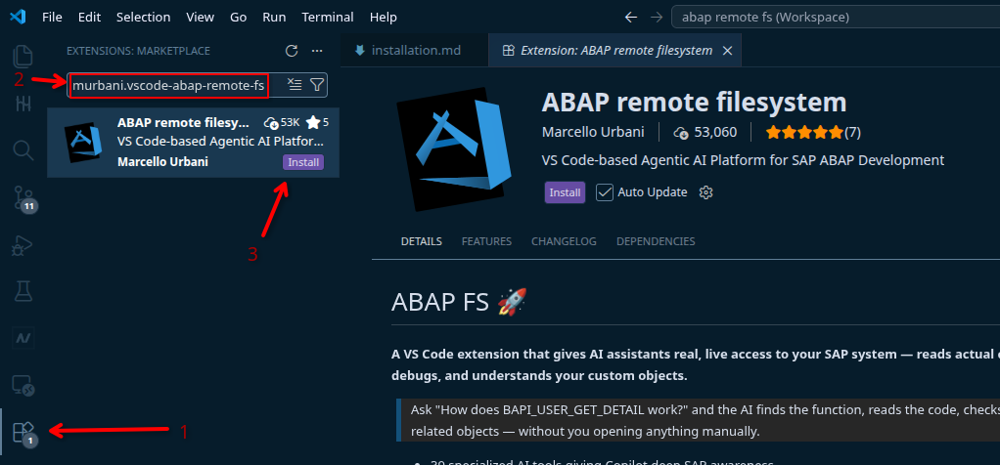

# Installation Steps

## 1. Install the extension

1. Press `Ctrl+Shift+X` or Click on the extension icon on the activity bar to open the **Extensions** panel (left sidebar)
2. Search for **murbani.vscode-abap-remote-fs** or **ABAP remote filesystem**
3. Click **Install**, then restart VS Code

## 2. Configure a SAP system connection

1. Press `Ctrl+Shift+P` to open the **Command Palette** (the search bar for VS Code commands)
2. Type and run: **ABAP FS: Connection Manager**
3. In the connection manager window, click **Add Connection** and fill in:
   - **URL** – your SAP system URL
   - **Client**, **Username**, **Language**
   - SAP GUI settings (optional)
4. Choose where to save the connection:
   - **User settings** – available in all your VS Code workspaces
   - **Workspace settings** – stored in the current project folder only

**Tips:**

- Passwords are stored in the OS credential manager, not in settings files.
- If a colleague already has connections configured, ask them to export via **Import/Export** and send you the JSON. User IDs and passwords are excluded from exports. You can then import and update your credentials in bulk using **Bulk Operations**.
- For SAP BTP systems, use **Cloud Support** to create a connection from a BTP Service Key or Endpoint.

## 3. Connect to a SAP system

1. Press `Ctrl+Shift+P` and run: **ABAP FS: Connect to an SAP system**
2. Select the system you configured
3. Enter your password if prompted
4. Wait a moment for VS Code to establish the connection

## 4. Verify the connection

- Look for the **ABAP FS** icon in the **Activity Bar** (the vertical icon strip on the far left)
- Expand the views: **Transports**, **Dumps**, **ATC Finds**, **Traces**, **abapGit**
- Test object search: `Ctrl+Shift+P` → **ABAP FS: Search for object**

## Updates

The extension updates automatically if installed from the VS Code Marketplace and auto-update is enabled. To check: open the Extensions panel (`Ctrl+Shift+X`), find the extension, and verify **Auto Update** is on.
