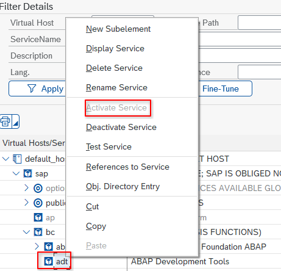

# Prerequisites

## Visual studio code or similar

This is a visual studio code extension, so needs a vscode compatible editor like:

- [Visual studio code](https://code.visualstudio.com/)
- [Vscodium](https://github.com/VSCodium/vscodium/)
- [SAP Business Application Studio](https://www.sap.com/products/technology-platform/business-application-studio.html)
  ... or any other derivative like Cursor, Windsurf, Kiro, Antigravity,...
  Might work in [Theia](https://theia-ide.org/) too but didn't last time I tried, over a year ago

## A SAP system reachable over HTTP

You need HTTP connectivity to your SAP system, and ICF node `/sap/bc/adt` must be activated in transaction SICF:

## Github copilot

The AI functions only work at their best with [Github Copilot](https://github.com/features/copilot/ai-code-editor)
We do support other agents through [the MCP server feature](../mcp-server.md) but not as well as copilot

## If your system is old (say before ECC 7.51) you might need a plugin

Write support will require you to install [abapfs_extensions plugin](https://github.com/marcellourbani/abapfs_extensions) in your development server. Browsing and reading work without it.
